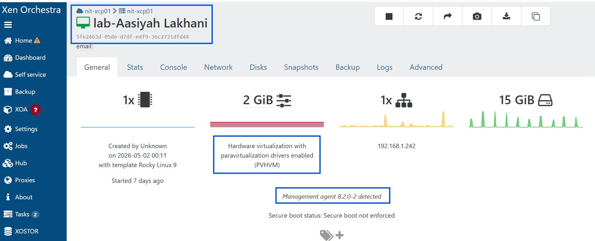

# Interview ka Sawal: Batain mujhay kia aapnay kabhi PATCHING ki hai?
> Thursday 13th May, 2026 - Day 6
# ⚠️ MANDATORY LAB UPDATE: GUEST TOOLS PATCHING

## Batch 3 ke Students tawajjo dein!

> NOTE:  
> Aapke virtual machines ki behtar monitoring aur optimization ke liye, NIT Academy infrastructure mein sab ko yeh patching karna lazmi hai.  
> Is se aapke dashboard par nazar aanay wala **"Management Agent Not Detected"** ka error khatam ho jayega.

---

# TASK 1

1. Apne Xen Orchestra instance mein login karein.  
2. Apni assigned Linux Machine ke console ko open karein.  
3. Niche di gayi commands ko `root` user ke tor par execute karein.  

---

# Step 1: Repositories Enable Karein aur Install Karein

```bash
# Pehle EPEL install karein
dnf install -y epel-release

# Guest Utilities install karein
dnf install -y xe-guest-utilities-latest
```

---

# Step 2: Post-Installation Validation (Check Karne ka Tariqa)

Is distribution service ko enable aur start karein:

```bash
systemctl enable --now xe-linux-distribution
```

---

# Final Submission

Jab patching mukammal ho jaye aur aapke dashboard se warning khatam ho jaye:

- Snipping Tool ka istemal karte hue apne terminal results aur Xen Orchestra mein nazar aanay wale green **"Agent Detected"** status ka screenshot lein.  

- LinkedIn Challenge:  
  Is screenshot ko LinkedIn par share karein taake aapki **100-Day Journey** ki progress record ho sakay.  

---

# LinkedIn Hashtag

```plaintext
#NIT
```

> Apni LinkedIn post mein yeh hashtag lagana mat bhoolein!